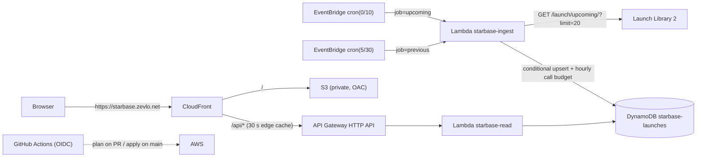

# starbase — Launch Mission Control

**Live:** https://starbase.zevlo.net

An automated launch-state telemetry pipeline on AWS. Every ten minutes an EventBridge
rule invokes a Lambda that polls [Launch Library 2](https://thespacedevs.com/llapi),
normalises the next ~20 launches (NET, status, pad, webcast) and upserts them into
DynamoDB. A read API (API Gateway + Lambda) and a CloudFront-hosted static dashboard
serve that state; the browser never contacts the upstream. Everything is Terraform,
deployed from GitHub Actions via OIDC.

> Designed and deployed an automated telemetry pipeline on AWS using EventBridge,
> Lambda, and DynamoDB, provisioned with Terraform and GitHub Actions.



## Why this is telemetry

Each launch is a remote object whose state changes over time: `net` slips,
`status` moves `TBD → TBC → Go → In Flight → Success`, `webcast_live` flips.
The pipeline samples that state on a fixed cadence, timestamps every observation
(`last_seen_at`, `ll_last_updated`, `last_changed_at`), records transitions
(`prev_status_abbrev`, structured `status_change` log events) and serves the
latest state with staleness metadata (`/api/v1/health`). Volume is low, so a
scheduler plus idempotent upserts is the right shape; Kinesis would be theatre.

## Rate-limit math

Launch Library 2's free tier allows **15 requests / hour / IP**.

| source | calls / hour |
|---|---|
| `cron(0/10 * * * ? *)` upcoming | 6 |
| `cron(5/30 * * * ? *)` previous | 2 |
| retries (max 1 per invocation, 5xx/network only, never on 429) | up to 8 |
| **hard cap** — DynamoDB conditional counter `RATE#LL2 / HOUR#<utc-hour>` | **12** |

The counter is incremented with `ConditionExpression: calls < :cap` *before* every
outbound request, so redeploys, manual invocations and retries cannot push past 12.
EventBridge target retries and Lambda async retries are both set to 0, and the
function has reserved concurrency 1, so there are no hidden multipliers.

## Repository layout

```
infra/            Terraform root (flat; one prod stack in us-east-1)
infra/bootstrap/  one-time: state bucket + GitHub OIDC roles (local state)
lambdas/ingest/   ingest_handler.py, ll2.py, mapping.py, store.py, local_run.py
lambdas/read/     read_handler.py, queries.py
lambdas/tests/    pytest (moto for DynamoDB)
fixtures/         captured LL2 payload + derived Hold / In Flight fixtures
web/              static dashboard (no build step) + mock boards
scripts/          make_fixture.py, make_mocks.py
.github/          ci.yml, terraform.yml (plan/apply), site.yml (S3 sync)
```

## DynamoDB design

Single table `starbase-launches`, on-demand, TTL on `expires_at`, PITR on.

| item | pk | sk | gsi1pk | gsi1sk |
|---|---|---|---|---|
| launch | `LAUNCH#<id>` | `META` | `LANE#UPCOMING` / `LANE#PAST` | `<net>#<id>` |
| run marker | `META#INGEST` | `JOB#upcoming` / `JOB#previous` | | |
| call budget | `RATE#LL2` | `HOUR#2026-09-07T05` | | |

"Upcoming sorted by NET" is one `Query` on `gsi1-lane-net` (`gsi1pk = LANE#UPCOMING`,
`gsi1sk >= now-6h`). ISO-8601 Zulu strings sort chronologically.

## API

All routes are `GET`, JSON, `Cache-Control: public, max-age=30`, and reachable at
`https://starbase.zevlo.net/api/v1/...` (same origin as the page, so CORS is moot).

| route | purpose |
|---|---|
| `/api/v1/board?limit=8` | hero + strip; the only call the dashboard makes |
| `/api/v1/launches?lane=upcoming\|past&limit=20` | list |
| `/api/v1/launches/{id}` | one launch |
| `/api/v1/health` | run markers; **503** when ingest is > 30 min stale |

## Dashboard rules

- Countdown ticks locally from the stored `net`; the board refreshes every 45 s ± 5 s.
- `Hold` replaces the clock with **HOLD** (+ hold reason); `In Flight` shows **IN FLIGHT** with `T+`.
- NETs with coarse precision (`DAY`+, or a bare `00:00:00Z`) render as `NET 30 SEP 2026`, not a fake countdown.
- **WATCH LIVE** appears only when a `webcast_url` exists; it links out — no video is proxied.
- `DATA STALE` chip when the API is unreachable or ingest is stale.
- Dev switches: `?mock=go|hold|inflight`, `?api=https://<api-id>.execute-api.us-east-1.amazonaws.com`.

## Local development

```bash
make venv && make test && make lint
make ingest-local                      # run ingest against lldev (unlimited, stale data)
make ingest-fixture FIXTURE=fixtures/hold.json
make web                               # http://localhost:8080/?mock=hold
make poke-hold                         # force the live hero into HOLD; next ingest restores truth
```

`lldev.thespacedevs.com` is for local use only; the Terraform variable validation
rejects it for `environment = "prod"`.

## Deploy from an empty account

1. `cd infra/bootstrap && terraform init && terraform apply` (admin credentials, once).
2. Set repo variables `AWS_PLAN_ROLE_ARN`, `AWS_APPLY_ROLE_ARN` from the outputs.
3. Push to `main` — `terraform.yml` applies the stack; set `SITE_BUCKET` and
   `CLOUDFRONT_ID` from the outputs and `site.yml` publishes `web/`.

No AWS access keys are stored anywhere; both workflows assume roles with GitHub OIDC.
There are no application secrets — LL2's free tier needs no API key.

## Cost

Roughly $0.50–1.50 / month: DynamoDB on-demand pennies, Lambda and CloudFront inside
the free tier, API Gateway ~$0.10, CloudWatch logs/alarms ~$0.70. The `zevlo.net`
hosted zone predates this project.

## Attribution

Launch data: [Launch Library 2](https://thespacedevs.com/llapi) by
[The Space Devs](https://thespacedevs.com). This project caches their free-tier
API and links to their images and webcasts; it does not redistribute the feed.
