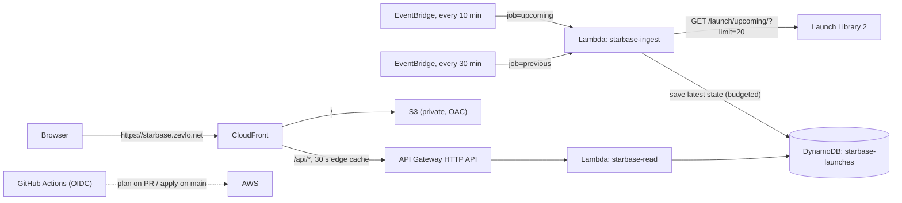

# starbase: Launch Mission Control

**Live dashboard:** https://starbase.zevlo.net

## What is starbase?

Starbase is a live dashboard for upcoming rocket launches. It counts down to the
next launch, flags holds, and links to the live video when one exists. A small
JSON API serves the same data for anyone who wants to build on it. The pipeline
behind it runs on AWS and refreshes the data automatically, every ten minutes,
from [Launch Library 2](https://thespacedevs.com/llapi).

## Highlights

- **Fully serverless on AWS.** EventBridge does the scheduling, Lambda does the
  computing, DynamoDB does the storage, API Gateway and CloudFront serve the
  reads. Zero servers to patch or babysit.
- **Everything is code.** One Terraform stack describes the whole system and can
  deploy it to an empty AWS account in three steps (see below).
- **Keyless deployments.** GitHub Actions proves its identity to AWS with OIDC,
  an open identity standard, so the repository stores zero cloud credentials.
- **Engineered around a hard limit.** The free data source allows 15 requests
  per hour. The pipeline meters itself with a counter in DynamoDB and
  hard-stops at 12, redeploys and retries included (details below).
- **Tested and linted.** pytest with moto (a local DynamoDB stand-in), ruff,
  terraform fmt, and JS syntax checks all run in CI.
- **Inexpensive.** Roughly $0.50 to $1.50 per month at current traffic.

## How it works

Every ten minutes, an EventBridge schedule (AWS's cloud cron) starts the ingest
function on Lambda. It asks Launch Library 2 for the next 20 launches, keeps the
fields the dashboard needs (launch time, status, pad, webcast link), and saves
each launch into DynamoDB, AWS's NoSQL database. Saving is safe to repeat:
writing the same launch twice changes nothing. A second schedule runs the same
function twice an hour to capture launches that just flew.

Reading is a separate path. When you open https://starbase.zevlo.net, CloudFront
(AWS's content-delivery network) serves the static page from a private S3 bucket
and forwards `/api` requests to API Gateway, caching them for 30 seconds at the
edge. A read function pulls the latest state from DynamoDB and returns JSON.
Your browser talks only to starbase; the upstream site receives traffic solely
from the ingest function.

Deploys flow through GitHub Actions: a Terraform plan on every pull request, an
apply on merge to `main`, and a site workflow that publishes the page.



## Why polling fits

Each launch behaves like a telemetry source: its state changes over time. The
launch time (`net`) slips. The status moves `TBD → TBC → Go → In Flight →
Success`. The webcast flips live. The pipeline samples that state on a fixed
cadence, stamps every observation with three timestamps (`last_seen_at`,
`ll_last_updated`, `last_changed_at`), records transitions
(`prev_status_abbrev`, plus structured `status_change` log events), and serves
the latest state with staleness metadata (`/api/v1/health`). Volume is low, so a
scheduler plus repeat-safe writes fits the problem. A streaming service would
add cost and complexity while producing the same result.

## Staying under the rate limit

Launch Library 2's free tier allows **15 requests per hour, per IP**.

| source | calls per hour |
|---|---|
| upcoming ingest, every 10 minutes | 6 |
| previous ingest, twice an hour | 2 |
| retries (at most 1 per run; network and 5xx errors only, 429 excluded) | up to 8 |
| **hard cap**: conditional counter in DynamoDB (`RATE#LL2 / HOUR#<utc-hour>`) | **12** |

Before every outbound request, the ingest increments an hourly counter in
DynamoDB under the condition `calls < 12`; the request is skipped when the
condition fails. This holds across redeploys, manual invocations, and retries.
EventBridge target retries and Lambda async retries are both set to 0, and the
function runs with reserved concurrency 1, so parallel executions are
impossible and the budget has no hidden multipliers.

## Repository layout

```
infra/            Terraform root (flat; one prod stack in us-east-1)
infra/bootstrap/  one-time: state bucket + GitHub OIDC roles (local state)
lambdas/ingest/   ingest_handler.py, ll2.py, mapping.py, store.py, local_run.py
lambdas/read/     read_handler.py, queries.py
lambdas/tests/    pytest (moto for DynamoDB)
fixtures/         captured LL2 payload + derived Hold / In Flight fixtures
web/              static dashboard (plain HTML/CSS/JS) + mock boards
scripts/          make_fixture.py, make_mocks.py
.github/          ci.yml, terraform.yml (plan/apply), site.yml (S3 sync)
```

## How the data is stored

One DynamoDB table, `starbase-launches`, holds everything. It bills on demand,
expires items through a TTL on `expires_at`, and keeps point-in-time recovery
on.

| item | pk | sk | gsi1pk | gsi1sk |
|---|---|---|---|---|
| launch | `LAUNCH#<id>` | `META` | `LANE#UPCOMING` / `LANE#PAST` | `<net>#<id>` |
| run marker | `META#INGEST` | `JOB#upcoming` / `JOB#previous` | | |
| call budget | `RATE#LL2` | `HOUR#2026-09-07T05` | | |

"Upcoming launches, sorted by launch time" is a single Query on the index
`gsi1-lane-net` (`gsi1pk = LANE#UPCOMING`, `gsi1sk >= now minus 6 hours`).
Launch times are stored as ISO-8601 Zulu strings, which sort chronologically as
plain text.

## The API

Every route is a `GET` that returns JSON with `Cache-Control: public,
max-age=30`. They live at `https://starbase.zevlo.net/api/v1/...`, on the same
domain as the page, so cross-origin setup is unnecessary.

| route | purpose |
|---|---|
| `/api/v1/board?limit=8` | hero + strip; the only call the dashboard makes |
| `/api/v1/launches?lane=upcoming\|past&limit=20` | list |
| `/api/v1/launches/{id}` | one launch |
| `/api/v1/health` | run markers; **503** when ingest is > 30 min stale |

## What the dashboard shows

- The countdown ticks locally from the stored launch time. The board refreshes
  every 45 seconds, give or take 5.
- A `Hold` replaces the clock with **HOLD** plus the hold reason; `In Flight`
  shows **IN FLIGHT** with a `T+` timer.
- Coarse launch times (day precision, or a bare `00:00:00Z`) render as a date
  label, for example `NET 30 SEP 2026`. A countdown would be misleading for
  those.
- **WATCH LIVE** appears only when a `webcast_url` exists, and it links out to
  the video.
- A **DATA STALE** chip appears when the API is unreachable or the data is
  stale.
- Dev switches: `?mock=go|hold|inflight` and
  `?api=https://<api-id>.execute-api.us-east-1.amazonaws.com`.

## Attribution

Launch data: [Launch Library 2](https://thespacedevs.com/llapi) by
[The Space Devs](https://thespacedevs.com). This project caches their free-tier
API and links out to their images and webcasts.
